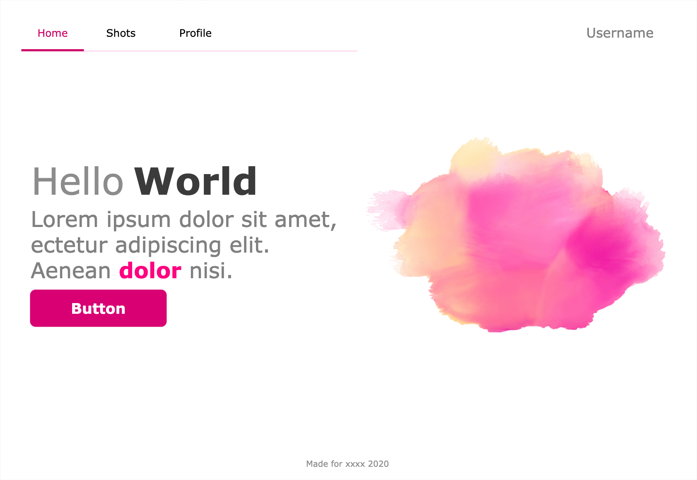

# Refactor of hero design

The purpose of this project is to redefine styles and mobile version of a hero banner design. The initial design is this:



## Demo

If you want to see a production demo of the project [click here](https://hero-markup.netlify.app/)

## Stack

-   HTML
-   SASS
-   Webpack

## Run locally

**1. Clone the repo**

```
git clone <url_of_the_repo>
```

**2. Install dependencies**

```
npm install
```

**3. Run local SASS compiler**

```
npm run sass:dev
```

**4. Run a local server**

```
npx serve
```

**5. Open the local server url as indicated in the terminal local server output**
Usually is `localhost:8080`.
